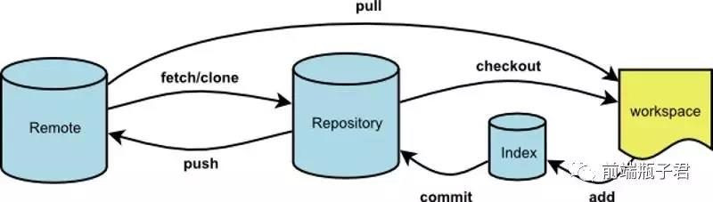
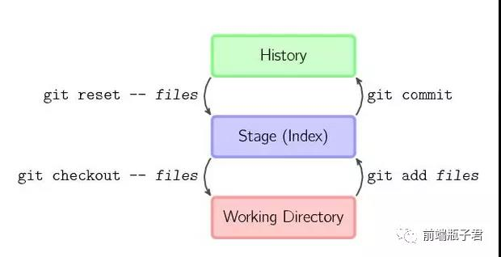

# gitdemo

用于熟悉git指令

查阅资料时在前端瓶子君处找到一张git流程图, 非常详细, 可以说是看懂后git直接入门





## 常用术语

Remote: 远程仓库
Repository: 本地仓库
stage/index: 暂存区/Git追踪树
workspace: 工作区(即平时修改文件后文件就都会被放到工作区上)

## 常用指令

### 常用操作篇

```git clone 地址```: 克隆master上最新的项目代码

```git status```: 查看当前仓库中各个文件的状态

```git add 文件名```: 将workspace中的文件提交到stage处

```git commit -m "提交信息"```: 将stage处的文件提交到repository（提交信息是可以不写的， 但**不推荐不写!**，提交信息可以在代码需要回退时提供信息说明）

```git push```: 将repository的文件提交到remote上

> 以上是平时开发中最常用到的五条指令，流程为: **workspace** -> ```git status```查看文件状态 -> ```git add .```将所有修改加入到**stage** -> ```git commit -m "xxx"```将代码提交到**repository** -> ```git push```将所有文件提交到**Remote**上

### 版本控制 文件管理

```git diff 文件```: 查看文件具体修改了什么内容

```git log (--pretty=oneline)```: 显示从最近到最远的提交日志(加上参数后可以过滤部分信息)

> 注: 在**commit id**后面有(HEAD -> main)字样的一串是提示你当前默认分支位于哪一个commit上

```git reset --hard HEAD~x```: 表示将版本回退到x个版本前

```git reset --hard commit-id```: 表示将版本回退到指定commit-id的版本

```git checkout -- 文件名```: 表示将当前处于**本地仓库**的文件取出, 替换掉当前**工作区**的文件. 即当前工作区该文件所做的修改都废弃了.(在对工作区代码一顿操作后发现不对劲时可以使用的ctrl+Z操作)

```git reset HEAD 文件名```: 将**本地仓库**的文件取出, 替换掉**暂存区**的文件.(如果写了错误的代码并且使用```git add 文件```进行了提交, 可以使用该指令来进行ctrl+Z操作)

> 撤销小结: 
> 1. 当我们乱改了工作区的代码想要直接丢弃工作区的代码, 那么我们可以使用```git checkout -- 文件```
> 2. 当我们乱改了工作区的代码并提交到了暂存区, 我们想要直接丢弃掉暂存区里该文件时, 使用```git reset HEAD -- 文件```, 这时候就会回到场景1. 然后按照场景1进行操作即可
> 3. 已经完成了commit操作, 那么就使用```git reset --hard HEAD~[x|commit-id]```来进行版本回退(**前提是没有推送到远程库)**
> 提示, 我们也可以通过```git status```来查看我们的文件处于什么状态, 若想要撤回, 可按照```git status```给予的提示来进行操作