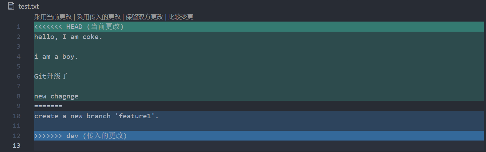
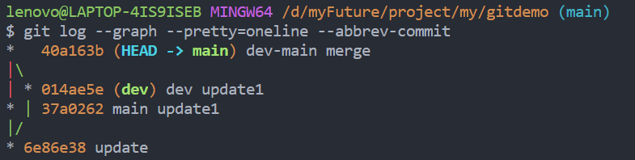

# gitdemo

用于熟悉git指令

查阅资料时在前端瓶子君处找到一张git流程图, 非常详细, 可以说是看懂后git直接入门


## 常用术语

Remote: 远程仓库
Repository: 本地仓库
stage/index: 暂存区/Git追踪树
workspace: 工作区(即平时修改文件后文件就都会被放到工作区上)

## 常用指令

### 常用操作篇

```git clone 地址```: 克隆master上最新的项目代码

```git status```: 查看当前仓库中各个文件的状态

```git add 文件名```: 将workspace中的文件提交到stage处

```git commit -m "提交信息"```: 将stage处的文件提交到repository（提交信息是可以不写的， 但**不推荐不写!**，提交信息可以在代码需要回退时提供信息说明）

```git push```: 将repository的文件提交到remote上

> 以上是平时开发中最常用到的五条指令，流程为: **workspace** -> ```git status```查看文件状态 -> ```git add .```将所有修改加入到**stage** -> ```git commit -m "xxx"```将代码提交到**repository** -> ```git push```将所有文件提交到**Remote**上

### 版本控制 文件管理

```git diff 文件```: 查看文件具体修改了什么内容

```git log (--pretty=oneline)```: 显示从最近到最远的提交日志(加上参数后可以过滤部分信息)

> 注: 在**commit id**后面有(HEAD -> main)字样的一串是提示你当前默认分支位于哪一个commit上

```git reset --hard HEAD~x```: 表示将版本回退到x个版本前

```git reset --hard commit-id```: 表示将版本回退到指定commit-id的版本

```git checkout -- 文件名```: 表示将当前处于**本地仓库**的文件取出, 替换掉当前**工作区**的文件. 即当前工作区该文件所做的修改都废弃了.(在对工作区代码一顿操作后发现不对劲时可以使用的ctrl+Z操作)

```git reset HEAD 文件名```: 将**本地仓库**的文件取出, 替换掉**暂存区**的文件.(如果写了错误的代码并且使用```git add 文件```进行了提交, 可以使用该指令来进行ctrl+Z操作)

> 撤销小结: 
> 1. 当我们乱改了工作区的代码想要直接丢弃工作区的代码, 那么我们可以使用```git checkout -- 文件```
> 2. 当我们乱改了工作区的代码并提交到了暂存区, 我们想要直接丢弃掉暂存区里该文件时, 使用```git reset HEAD -- 文件```, 这时候就会回到场景1. 然后按照场景1进行操作即可
> 3. 已经完成了commit操作, 那么就使用```git reset --hard HEAD~[x|commit-id]```来进行版本回退(**前提是没有推送到远程库)**
> 提示, 我们也可以通过```git status```来查看我们的文件处于什么状态, 若想要撤回, 可按照```git status```给予的提示来进行操作

```git rm 文件```: 确认将工作区的文件删除.

> Tip: 若有文件被误删且还没提交, 可以用该```git status```查看文件状态, 使用```git checkout -- 文件```来还原文件, 然后```git commit -m "xxx"```提交到本地仓库. 但如果还没有被提交到本地仓库的话... 当我没说.

## 分支

Git一个最强大的功能之一便是**分支**, Git通过指针的方式来对分支进行各种各样的操作, 效率极高, 是其他版本控制软件所无法比拟的.

深入了解Git中的分支, 可以参考["廖雪峰老师的Git教程"](https://www.liaoxuefeng.com/wiki/896043488029600/900003767775424). 这里主要记录指令作用.

Git鼓励大量使用分支, 在分支上进行开发, 最后再将分支合并到主分支上. **分支是Git称为多人协作工具的一大利器**

### 创建分支

可以通过```git checkout -b 分支名称```来创建并切换到目标分支, 但```checkout```指令与版本回退的指令容易造成混淆. Git推荐我们使用```switch```来进行分支管理

```git switch -c 分支名称```: 创建并切换分支


### 合并

#### 无冲突合并

```git merge 分支名称```: 无冲突合并最为简单, 通过该指令即可将当前分支与目标分支合并. 这也是Git合并分支中最直接暴力的模式——```Fast forward```

我们可以通过```git merge --no-ff 分支名称```来禁用```Fast forward```模式, 因为```Fast forward```模式会直接将分支合并, 在git log中我们并不能看到有分支合并的痕迹, 因此我们在开发过程中, 最好是不使用这种暴力的模式.

#### 冲突合并

冲突合并是常有的是, 特别是多人协作的时候, 而Git为我们提供了一套解决冲突的办法: 我们可以利用可视化来选择如何进行冲突合并, 在把冲突解决掉后, 提交即可. 

指令同为```git merge```, 然后VS Code会显示冲突, 如下图:



选择响应的方案进行合并, 然后提交. 便可完场冲突合并

```git log --graph (--pretty=oneline --abbrev-commit)```: 该指令可以让我们查看分支合并的路线情况(加上后续参数只要是为了过滤多余信息)



在开发过程中, 如果我们不需要开发分支了, 直接将其删除即可. 

### Bug分支

在开发中, 我们经常会遇到有一些紧急的BUG需要修复, 这时候我们就要先放下我们手头上正在开发的工作, 前往修复BUG. 但就会遇到一个尴尬的场景, 我们希望将分支切换到出现BUG的分支上, 可是当前工作区的代码还不想提交, 而不提交就没有办法切换分支... 陷入到一个死循环当中.

不得不说Git是真的强大, 提供了一个**保留现场**的功能, git的```stash```可以让我们把工作区的代码像保存到stash list中, git会自动清空工作区, 我们这时候就可以切换到有BUG的分支, 当我们处理完BUG回来后, 再从stash list取出我们上次保留的现场即可.

```git stash```: 将工作区保留到stash list中, 同时清空工作区

```git stash list```: 查看stash list

```git stash pop```: 取出stash list[0]来还原工作区, 并删除stash list的栈顶元素

```git cherry-pick commit-id```: 复用某commit-id的修改. 常用于修复某个分支的BUG, 然后该分支有衍生出其它的分支, 因此导致其余分支也有同样的BUG, 我们可以利用该修改, 作用到其他的分支上.

### 删除分支

```git branch -d 分支名称```: 删除分支.

```git branch -D 分支名称```: 没有合并过的分支, 需要通过该指令来强制删除.

# 总结 

以上就是Git最常见的指令以及开发中可能遇到的场景. 使用Git进行多人协作放在中, 感兴趣的小伙伴可以点击链接前往.