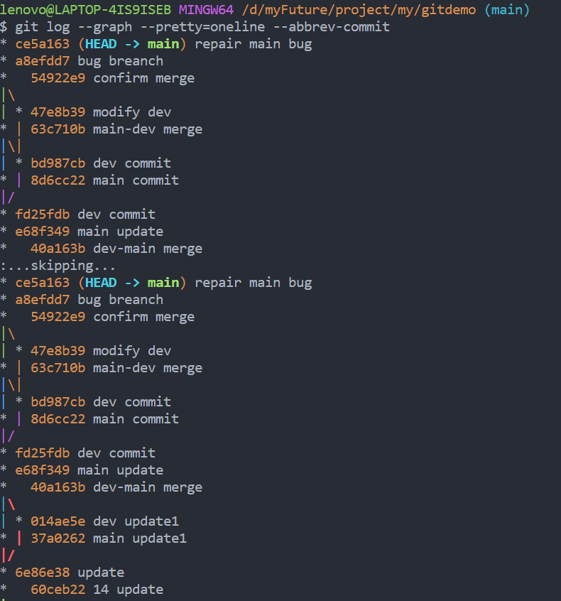

# 前言

本章用于介绍如何利用Git进行多人协作开发, 需要具备一些前置知识: Git的基本指令, 以及常见场景的应对措施. 对Git基础掌握不牢固的小伙伴可以移至;

## 查看远程库信息

```git remote```: 获取远程主机名列表(默认情况下, 我们通过git clone克隆下来的代码远程主机名都是```origin```). 我们可以简单理解为, 我们要拉取或者推送代码时, 需要指定是对哪一个远程仓库进行操作. 所以要指定对应的主机名称.

```git remote -v```: 打印远程主机名及详细信息

## 推送分支

推送分支就是我们在本地写好了我们的项目文件, 然后我们要保存到远程主机上, 这样和我们开发的小伙伴们才能够收到我们写的代码.

```git push 主机名称 分支名称```: 将repository的所有文件推送到指定远程主机的分支上.

最常见的就是```git push origin master```, 往主分支上推送.

> Tip:
> 不是所有的分支提交完都需要推送到远程主机, 只有需要跟开发小伙伴们协作开发的代码才需要上传到远程仓库. 或者是其它的一些团队规定要求推送到远程仓库上. 很多时候, 如果我们希望自己敲敲的优化项目代码, 然后惊艳所有人时, 我们都是自己在本地偷偷玩耍的.

## 拉取分支

当有其它小伙伴赶在我们前面将它的代码推送到远程仓库, 恰好我们的代码与它的代码有冲突时, 我们此时进行推送, Git就会显示推送失败: ```error: failed to push some refs to 'git@github.com:xxx'```

解决也很好解决, 我们只需要将此时远程仓库中的代码拉取下来, 和我们本地的代码进行合并, 解决掉冲突, 提交后就可以完成推送了.

```git pull```: 拉取远程仓库的分支

这时候很有可能会出现另一个错误: ```There is no tracking information for the current branch.
Please specify which branch you want to merge with```

这是因为没有指定```本地分支```与远程```origin/分支名称```进行链接.

我们可以通过: ```git branch --set-upstream-to=origin/分支名称 本地分支名称```来建立链接.

最后使用```git pull```即可以完成拉取, 解决冲突合并后提交, 即可以完成推送了.

> 小结:
> 1. 当我们在本地完成开发后, 尝试使用git push来推送分支
> 2. 若推送失败, 那么很可能是存在冲突, 需要用git pull来合并分支解决冲突
> 3. 如果git pull提示"no tracking information", 那么说明本地分支和远程分支无建立链接关系, 用命令```git branch --set-upstream-to <branch-name> origin/<branch-name>```建立链接即可.
> 4. 解决完冲突后进行提交, 再一次git push来推送分支

## rebase

我们先用```git log```看看我们之前的提交流程图:



好家伙, 那叫一个山路十八弯, 唐僧西天取经九九八十一难也就跟着差不多吧...

这个流程图着实很难让我们一眼就看出分支的变化趋势, 在code review的时候, 要找人来背锅都不好找. 而这其实是因为在git的默认策略中, 如果远程分支和本地分支之间提交路线有交叉的话(即不是ff模式), 那么git会执行一次```merge```操作, 产生一次没必要的提交记录, 从而造成混乱. 

假设在git pull前是这样的:
>       A---B---C  remotes/origin/master
>      /
> D---E---F---G  master

那么执行git pull后就会变成这样:
>       A---B---C remotes/origin/master
>      /         \
> D---E---F---G---H master

那有没有什么办法有简化这个分支呢? rebase这时候就有话要说了.

如果我们执行的是```git pull --rebase```的话, 那么提交线图就可以"化曲为直":
>             remotes/origin/master
>                 |
> D---E---A---B---C---F'---G'  master

C和G的冲突解决, 然后A-B-C直接接到E的后面. 这就实现了流程图变成一条直线. 让我们可以更方便的进行code review.

另外, 其实```git pull --rebase```指令是比较危险的, 他比直接使用```git pull```更容易导致冲突的产生. 如果预期冲突较多时, 建议使用```git pull```.

## pull request

```pull request```简称PR, 是Git多人协作开发的一大利器. 下面举个非常常见的例子. 

开发一个项目, 难免遇到很多Bug, 这时候有Bug分配到你手上, 需要你来修复这个Bug. 

通常我们会通过如下流程来修复Bug:
1. 将代码从远程仓库fork到本地
2. 在本地开启一个Bug分支来fix bug. (关于Bug分支的介绍, 可以移至[《Git基础知识》](""))
3. bug修复完毕后, 提交到远程仓库, 这个提交, 就称为PR.
4. 仓库的管理者会向review我们提交的PR, 没问题后就将代码merge到对应的分支上.

以上就是项目开发中最常见的Bug修复流程, 当然了, PR你可以给任何一个开源项目提, 但是对方接不接受就是另外一回事儿了.

> 小结: 如果对本地的冲突合并熟悉的话, 那么要来理解PR就相对简单了. 不过还有几个点需要我们记住:
> 1. 每次提交PR的时候, 标题尽可能起得简单易懂.
> 2. PR的注释最好是写的, 尽量把代码内容以及修复什么内容都写清楚.
> 因为是多人协作, 每个团队成员都做到以上两点在code review时会更加清晰, 可以加快团队的开发效率.